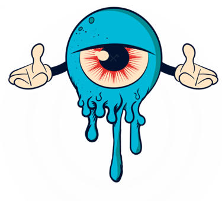
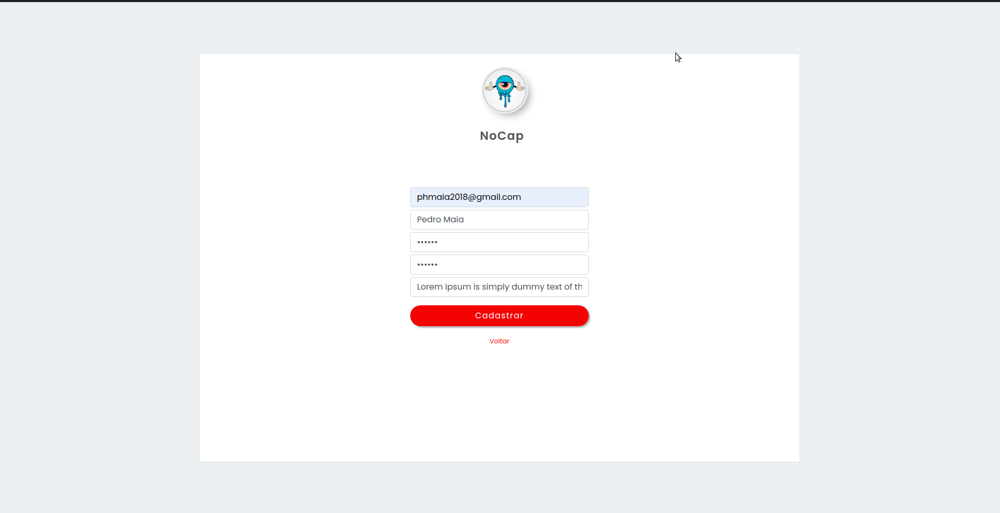
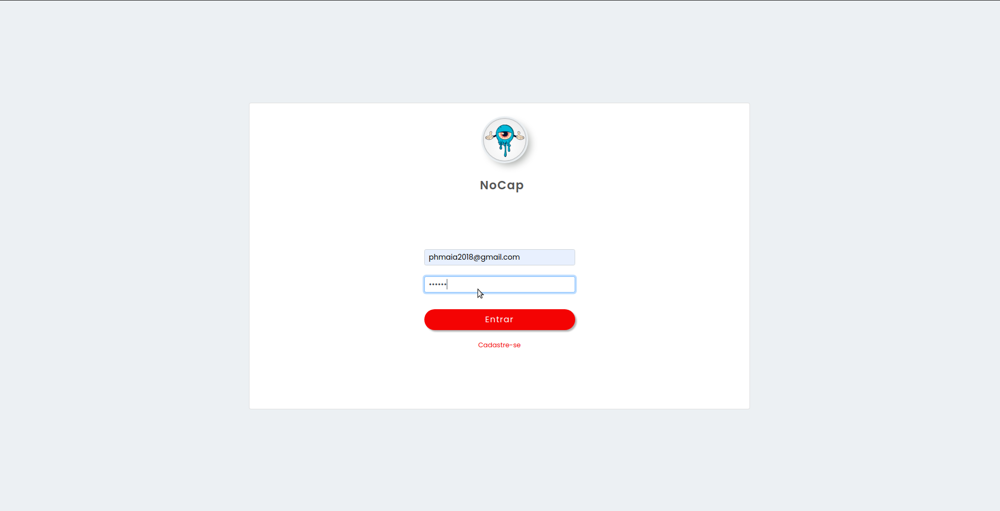
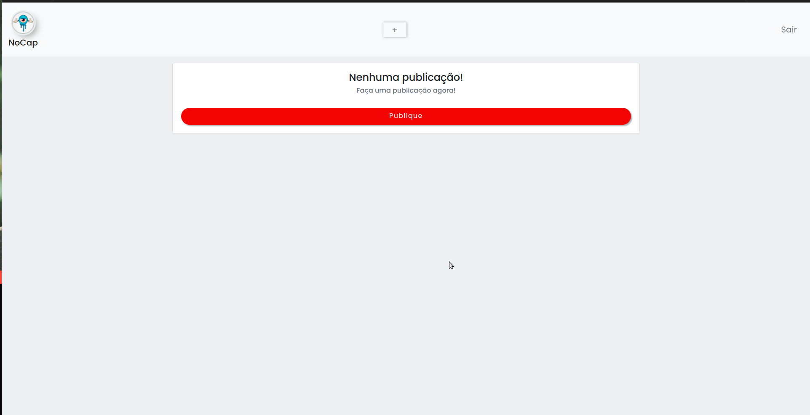
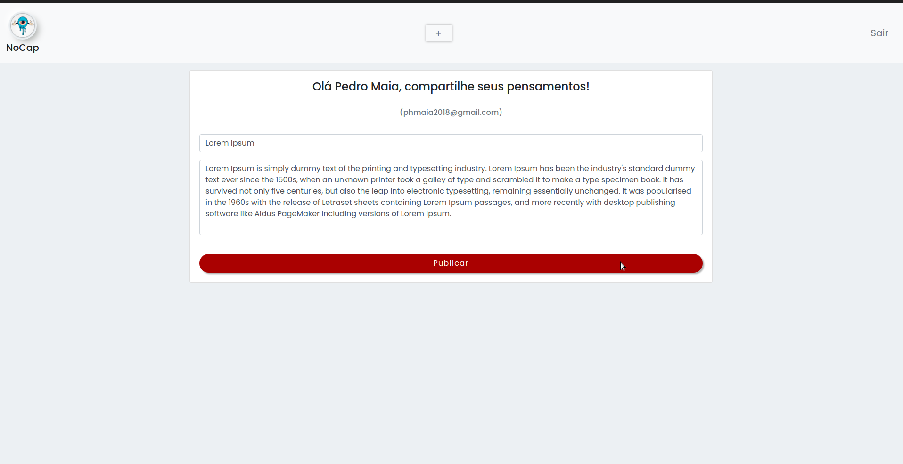
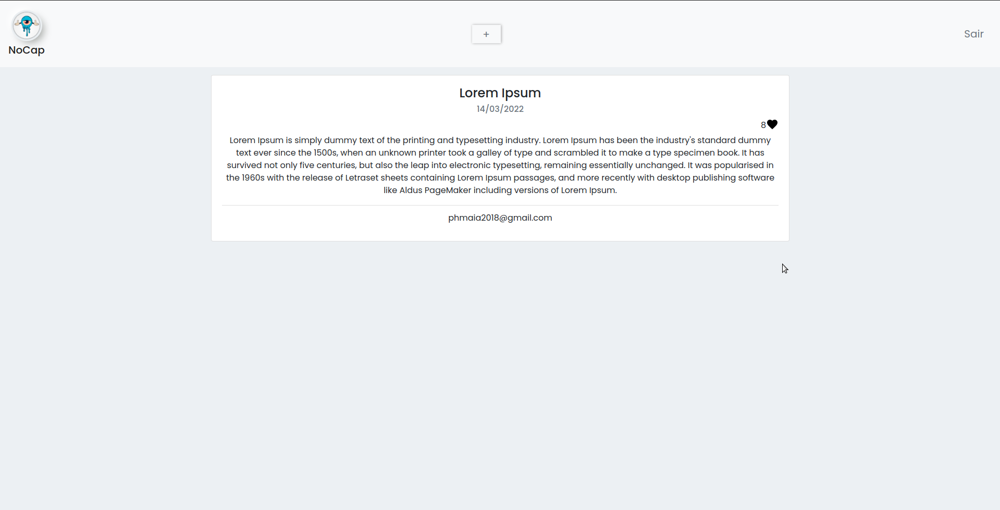
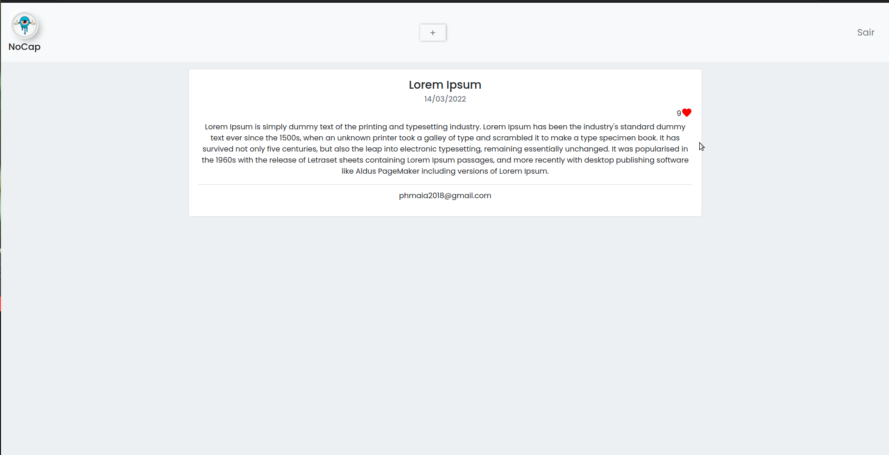

<!-- <p align="center" style="wisth: 200px">
  
</p> -->
<h1 align="center">NoCap - Blog</h1><br>

## Comando para subir o backend na porta 8000 no localhost
partindo da raiz do projeto
```
$ cd backend
$ npm run install
$ npm run build
$ docker-compose up
```

## Comando para subir o fronten na porta 3000 no localhost
partindo da raiz do projeto
```
$ cd frontend
$ npm run install
$ npm run start
```
------------------------------------------------------
## Comando para rodar os testes unitarios
partindo da raiz do projeto com o backend iniciado
```
$ npm run test:watch

ou

$ npm run test:watch <nome do arquivo(service)>
```
-----------------------------------------------------
## Sobre o Projeto (Tecnologias, banco de dados, finalidade...)
- Backend do projeto desenvolvido em [NestJs](https://nestjs.com/)
    - Banco de dados (PostgresSQL)
    - TypeOrm
    - Graphql
    - Docker
    - JWT

<br>

- Frontend desenvolvido em [ReactJS](https://pt-br.reactjs.org/)
    - Bootstrap 4
    - Apollo Client


-----------------------------------------------------
## Layouts do projeto
<br>
(Tela para criar sua conta)


<br>
(Tela para fazer login)


<br>
(Tela "Home" do projeto, resposavel por listar todas as publicações)


<br>
(Tela responsavel de criar publicação)


<br>
(Tela "Home" do projeto, listando as publicações criadas)


<br>
(Curtindo publicações na tela "Home" do projeto)

